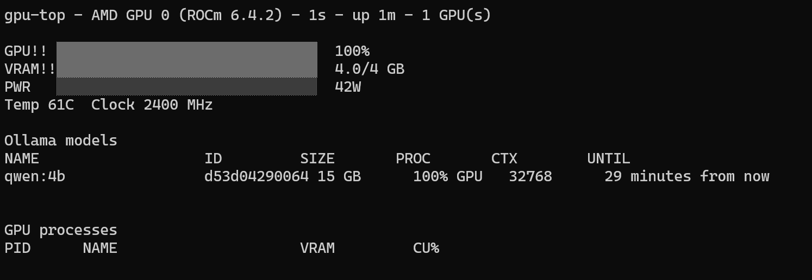

# GPU Top

GPU Top is an experimental htop-style terminal monitor for AMD GPUs. It shows live GPU utilization, VRAM, power, temperature, clock speed, Ollama models, and GPU processes.



## NLA Test Project

GPU Top was created as a real development test for [Next Level Agent](https://github.com/pickleshell/next-level-agent). The user supplied a short initial request, selected the main product parameters, and approved the design. NLA then planned, implemented, tested, reviewed, and completed the application without manual coding intervention.

See [Initial Task](INITIAL_TASK.md) for the original prompt and selected parameters.

## Features

- Live GPU, VRAM, and power bars
- Temperature and GPU clock readings
- Ollama model panel based on `ollama ps`
- GPU process list with PID, VRAM, and compute usage
- Multiple AMD GPU support
- Sorting, scrolling, pause, panel focus, and confirmed process termination
- Configurable refresh interval, initial device, and warning thresholds
- AMD SMI as the primary data source, with Linux sysfs fallbacks for APU metrics
- Headless `--check` mode and unit tests

## Requirements

- Linux with an AMD GPU
- ROCm with AMD SMI headers and `libamd_smi`
- `ncursesw`
- A C11 compiler, `make`, and `pkg-config`
- Ollama is optional

The Makefile first checks `/opt/rocm-6.4.2`, then `/opt/rocm`. Override the path when needed:

```bash
make ROCm_ROOT=/opt/rocm
```

## Build and Run

```bash
make
make test
./gpu-top --check
./gpu-top
```

## Controls

| Key | Action |
| --- | --- |
| `q` | Quit |
| `Space` | Pause or resume updates |
| `d` | Select the next GPU |
| `s` | Change process sorting |
| `Up` / `Down` | Move through the focused panel |
| `PgUp` / `PgDn` | Scroll the focused panel |
| `Tab` | Change panel focus |
| `k` | Terminate the selected GPU process after confirmation |

## Configuration

GPU Top reads `~/.gpu-toprc` at startup:

```ini
refresh = 1
device = 0
warn = 60
crit = 85
```

## Status

This is an experimental utility developed and tested on an AMD APU, with Radeon 780M as the original target. Hardware support may vary by ROCm version and driver. Review the selected PID carefully before using `k`.
